# Hi, I'm Sajan 👋

Civil engineer who found his way into product.

I'm learning product management by doing it—breaking down products, writing PRDs, solving PM case studies, building MVPs, and creating portfolio projects to understand how great products are designed, launched, and scaled.

Focused on:
- Understanding users and uncovering problems
- Product strategy and systems thinking
- Growth, experimentation and analytics
- Building AI-native products and workflows

Currently obsessed with understanding how great products go from 0 → 1 and how AI changes the way products are built.

## 🚀 Currently Building

- **[Flipkart Post-Purchase Experience](https://github.com/sajanbodele/Flipkart-Post-Purchase-Experience)** → Unified returns, warranty, installation, setup, and support into a seamless post-purchase lifecycle platform.
- **[Storemate](https://github.com/sajanbodele/Storemate)** → AI-powered platform for modern online commerce.
- **[EnvCube](https://github.com/sajanbodele/EnvCube)** → Interactive 3D cube with immersive 360° HDR reflections.
- **[Typespace](https://github.com/sajanbodele/Typespace)** → Immersive 3D typography experience inspired by San Francisco.

## 🛠 Tech Stack

## 📊 Skill Radar

<table align="center">
<tr>
<td width="50%" align="center">

<picture>
  <source media="(prefers-color-scheme: dark)" srcset="assets/radar-dark.svg">
  <source media="(prefers-color-scheme: light)" srcset="assets/radar-light.svg">
  
</picture>

</td>

<td width="50%" align="center">

<picture>
  <source media="(prefers-color-scheme: dark)" srcset="assets/radar-toolkit-dark.svg">
  <source media="(prefers-color-scheme: light)" srcset="assets/radar-toolkit-light.svg">
  
</picture>

</td>
</tr>
</table>

## 📈 GitHub Contributions

  <picture>
    <source media="(prefers-color-scheme: dark)" srcset="https://raw.githubusercontent.com/sajanbodele/sajanbodele/output/github-snake-dark.svg">
    <source media="(prefers-color-scheme: light)" srcset="https://raw.githubusercontent.com/sajanbodele/sajanbodele/output/github-snake.svg">
    
  </picture>

---

Building AI-powered products that solve real user problems. Open to Product Intern, APM, and Product Analyst opportunities.
